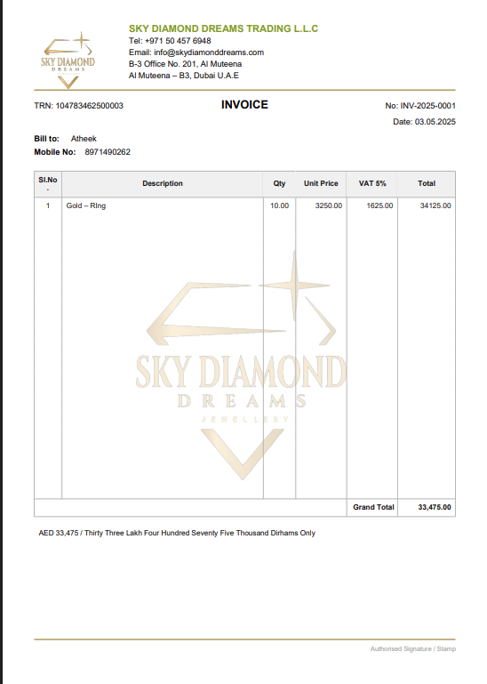

# 💼 Billing Software (MERN Stack)

A full-featured billing and invoice management system built with the **MERN stack**: MongoDB, Express.js, React, and Node.js.

This software is designed for businesses (like jewelry stores, small retailers, and service providers) to manage invoices, customers, pricing, and taxation with ease.

---

## 🚀 Features

- 👤 User authentication (Admin/User roles)
- 🧾 Create and manage invoices with dynamic fields
- 🖨 Export invoices as PDF
- 📊 Dashboard with real-time metrics
- 💰 Tax & Rate configuration
- 📦 Itemized billing with descriptions and quantities
- 📁 Organized monorepo structure (frontend & backend)

---

## 📁 Project Structure

<pre> ``` billing-software/ ├── backend/ # Node.js + Express + MongoDB │ ├── models/ # Mongoose models │ ├── routes/ # API routes │ ├── server.js # Entry point │ └── .env # Backend environment variables │ └── frontend/ # React + Vite + Tailwind ├── src/ │ ├── components/ # UI components │ ├── pages/ # Pages like Dashboard, Create Invoice │ └── main.jsx # Frontend entry point └── .env # Frontend environment variables ``` </pre>
---

## 🔧 Technologies

- **Frontend**: React, Vite, Tailwind CSS
- **Backend**: Express.js, Node.js, Mongoose
- **Database**: MongoDB Atlas
- **PDF Export**: jsPDF
- **Deployment**: Render (backend), Vercel or Netlify (frontend)

---

## 🛠 Setup Instructions

### 1. Clone the repository

```bash
git clone https://github.com/your-username/billing.git
cd billing
```
### 2. Install dependencies

```bash
# Backend
cd backend
npm install

# Frontend
cd ../frontend
npm install

```
### 3. Configure environment variables
Create .env files in the respective folders:

backend/.env
```bash
MONGODB_URI=your-mongodb-atlas-connection
PORT=5000
```
frontend/.env
```bash
VITE_API_URL=https://your-backend.onrender.com/api
```
### 4. Run the app locally
```bash
# Start backend
cd backend
node server.js
```
### Open a new terminal and run:
```bash
# Start frontend
cd frontend
npm run dev
```

## 🌐 Deployment
Backend: Deployed on Render

Frontend: Deployed on Vercel or Netlify

## 📸 Screenshots

### 🔐 Login Page


### 📊 Admin Dashboard


### 🧾 Create Invoice


### 🖨 PDF Export Preview


### 💰 Update Rates / Tax


## 📜 License
This project is licensed under the MIT License.

